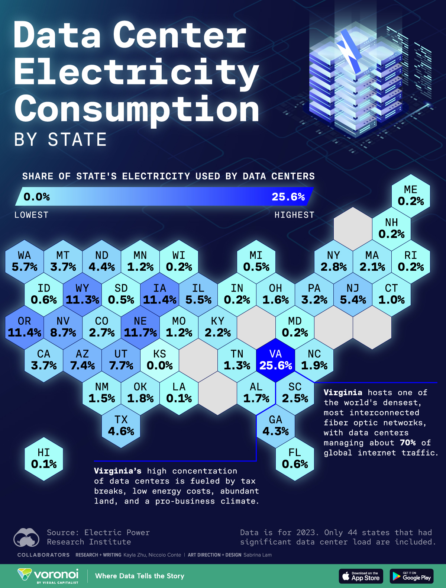
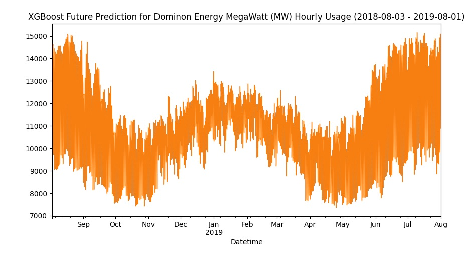
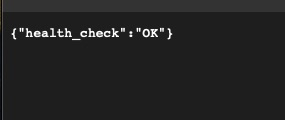
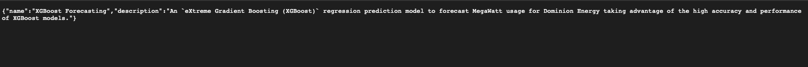
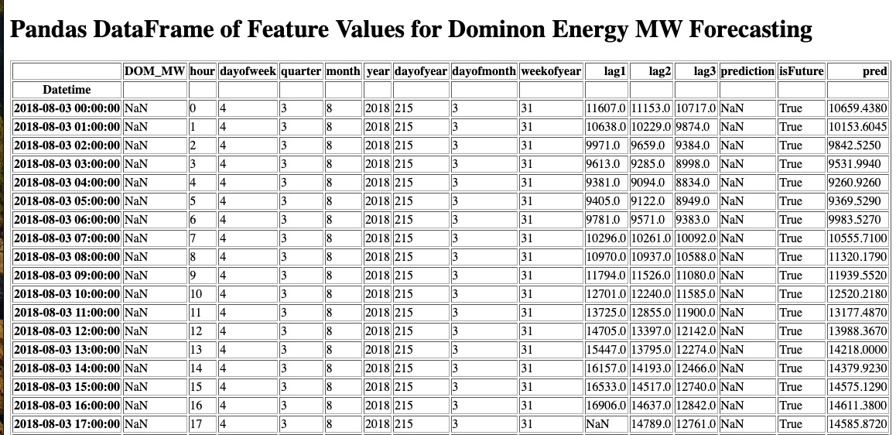

# Time Series XGBoost Forecasting Application - Predicting Dominion Energy Megawatt (MW) Hour Usage

<p>
  
</p>

<br>


[](https://github.com/beenlanced/ts_forecasting_project_dominion_energy_mw/actions/workflows/ts_forecasting_test.yml)

---

## Project Description

From 2005 through 2018, Virginia consistently has had the highest data center electricity use of all of the states in the United States. In fact, Virginia is often referred to as "Data Center Alley" as it hosts the largest concentration of data centers in the world, particularly in Northern Virginia. [David Kidd](https://www.governing.com/infrastructure/the-data-center-capital-of-the-world-is-in-virginia) pointed out that in 2023 there were nearly 300 data center estimated to handle more than one-third of global online traffic. Northern Virginia data centers had a combined power consumption capacity of 2,552 MW. That’s four times the capacity of the next closest American markets, Dallas (654 MW) and Silicon Valley (615 MW) [[src]](https://www.visualcapitalist.com/cp/top-data-center-markets/).

This dominance is due to a combination of factors: proximity to government agencies, strong internet infrastructure, and favorable tax incentives according to [Statistica Research Department's Nov 26, 2024 Data Center Electricity Consumption share in the United States 2023 by state report](https://www.statista.com/statistics/1537743/us-data-center-electricity-use-share-by-state/). Not to mention, there are 26 root DNS servers in Northern Virgina.

In total, there are approximately 580 data centers in total in the entire State of Virgina [[src]](https://www.datacentermap.com/usa/virginia/).

[Dominon Energy, Inc. ](https://en.wikipedia.org/wiki/Dominion_Energy), commonly referred to as Dominion, is the energy company headquartered in Richmond, Virginia that supplies electricity in parts of Virginia, North Carolina, and South Carolina and supplies natural gas to parts of Utah, Idaho and Wyoming, West Virginia, Ohio, Pennsylvania, North Carolina, South Carolina, and Georgia. Dominion also has generation facilities in Indiana, Illinois, Connecticut, and Rhode Island. Data centers represent the only growing sector of electricity demand in Virginia [[pg 5]](https://rga.lis.virginia.gov/Published/2021/SD17/PDF), accounting for 21% of Dominion Energy’s electricity sales [[pg 26]](https://s2.q4cdn.com/510812146/files/doc_financials/2022/q4/2023-02-08-DE-IR-4Q-2022-earnings-call-slides-vTC-Final.pdf).

### Problem

Could we build a machine learning model to predict the energy consumption usage for Dominion Energy given multiple years worth of hourly MW hour consumption data?

#### My Proposed Solution

I use a `eXtreme Gradient Boosting (XGBoost)` regression prediction model to forecast MW usage for Dominion data. I take advantage of the high accuracy and performance of XGBoost models for my predictor. I used the estimated energy consumption in MW per 24 hour period per day from [Dominon Energy, Inc.](https://en.wikipedia.org/wiki/Dominion_Energy) between 2005-04-30 and 2018-01-02 as the data was freely available in Kaggle.

I used a couple of Python Jupyter notebooks to perform data analysis, feature engineering, and Machine Learning model development. In my data analysis, I noticed that there were outliers in the MW hour data that would reduce my ML model accuracy because the outliers would mislead the model during training. As a result, I used Tukey Box plot whiskers (high and low) to filter out outliers.

At the same time to improve the model's generalization ability, I performed `Time Series Cross Validation`, splitting the data into multiple subsets, training the model on some subsets, and then evaluating it on the remaining subsets in order to arrive at a more robust estimate of the model's generalization ability.

I used Mean Square Error (MSE) to measure error in the machine learning models because I want to penalize large errors more severly. I compared the MSE results of the models attempted to choose the best performing model overall.

Lastly, I performed feature engineering to create new features from the original data as there was only one feature value in the original data set. These features included: **dayofyear, hour, dayofweek, quarter, month, year, lag1, lag2, and lag3**. Lag1, lag2, and lag3 are, `lag features`, the past values of a variable used to predict future values. I created these features by shifting the time series data by one, two, and three years. For example, a lag of one used the previous year's MW hour values to predict the future year's values.

#### Solution Summary

I created an XGBoost time series prediction model upon which I can predict future MW hour values by supplying input feature data to the model.

<p>
    
</p>

Via a FastAPI web application, I render an example of future MW hour forecasts/predictions for a year's worth of feature data as a Matplotlib plot visible via a FastAPI endpoint. The derived feature data input set can be seen via a different Fast API endpoint (see results below for running the application)

The FastAPI web application can be run locally and by an `Amazon Web Services - Elastic Container Service (AWS-ECS)` cloud service that allows users to utilize the XGBoost ML model to render the proposed future time horizon using the future feature data values. The cloud service pull's a Docker image from Docker Hub and builds a container to run the service.

Lastly, I used Github Actions to perform CI/CD of the model generation and Fast API code such that functional and units tests are performed during any new model development and a Docker image that will build the FastAPI web app and supply the machine learning model and associated data get's pushed to Docker Hub. Subsequently, an AWS-ECS services can pull the image and essentially run a web service to utilize the forecast model to render results via a browser web interface.

---

## Data

Obtained from Kaggle: [here](https://www.kaggle.com/datasets/robikscube/hourly-energy-consumption?resource=download&select=DOM_hourly.csv)

I use the estimated energy consumption in MWs per 24 hour period per day from [Dominon Energy, Inc. ](https://en.wikipedia.org/wiki/Dominion_Energy) between 2005-04-30 and 2018-01-02. Commonly referred to as Dominion, it is an American energy company headquartered in Richmond, Virginia that supplies electricity in parts of Virginia, North Carolina, and South Carolina and supplies natural gas to parts of Utah, Idaho and Wyoming, West Virginia, Ohio, Pennsylvania, North Carolina, South Carolina, and Georgia. Dominion also has generation facilities in Indiana, Illinois, Connecticut, and Rhode Island.

---

## Objective

The project uses the well-known `source (SRC)` layout structure. It contains the key elements:

- `AWS-ECS`, Amazon Web Services - Elastic Cloud Service, runs virtual machine to render the time series forecast web application supplied by building a Docker container from a deployed Docker image from Docker Hub,
- `CI/CD` automated pipeline created using `GitHub Actions`,
- `Cross Validation` Time Series validation,
- `Docker`. Application code is containerized so it can be deployed just as easily to a user's host machine or to the cloud. It uses a Dockerfile that employs a multi-stage docker build using `uv`,
- `EDA` notebooks for feature engineering, data analysis and `XGBoost` time series prediction modeling,
- `FastAPI` web framework use to build APIs for this semantic search application,
- `Functional tests` and `unit tests` using `pytest`,
- `Git` (version control),
- `GitHub` with a pull request template like you might use at work,
- `NLP` to translate user defined queries into the closest matches of related video content,
- `Type` hinting using `Pylance`,
- `Web application` using `FastAPI`, and
- `uv` package management including use of `ruff` for linting and formatting.

---

## Tech Stack


---

## Project Structure

```
.
├── data
│   └── DOM_hourly.csv
├── Dockerfile
├── imgs
│   ├── data_center_usage.jpg
│   ├── entry_route.jpg
│   ├── forecasting_data.jpg
│   ├── info_api_route.jpg
│   └── plot_forecast.jpg
├── LICENSE
├── pyproject.toml
├── README.md
├── src
│   ├── app.py
│   ├── eda
│   │   ├── eda_adv.ipynb
│   │   ├── eda_initial.ipynb
│   │   ├── future_values.csv
│   │   └── model.json
├── templates
│   └── dataframe_template.html
├── tests
│   ├── functional
│   │   └── test_api.py
│   └── unit
│       └── test_create_plot_image.py
└── uv.lock
```

---

## Installation Steps

### Option 1: Installation from GithHb with UV (recommended)

Here are the steps to install and set up a GitHub repository as a package/project directly from a `GitHub` repository using `uv`:

1. **Install uv**

   - If you haven't already, install uv. Several installation methods are available, including using a standalone installer or installing from PyPI with pipx or pip.

     - Using the standalone installer (example for macOS/Linux)

       ` curl -fsSL https://astral.sh/uv/install.sh | s`

   - Install from GitHub: Use `uv pip install` with the GitHub repository URL. The format is.

     `uv pip install git+https://github.com//<repo>.git`

   - To install a specific branch, tag, or commit, add `@<reference>` to the URL.

`uv pip install git+https://github.com/beenlanced/ts_forecasting_project_dominion_energy_mw.git@<branch_name>`

- Editable installs: For local development where you want changes in the repository to be immediately reflected, use the `-e` flag.

`uv pip install -e git+https://github.com/beenlanced/ts_forecasting_project_dominion_energy_mw.git`

- Specifying dependencies in pyproject.toml: You can also add the GitHub repository as a dependency in your pyproject.toml file.

  [tool.poetry.dependencies]
  your_package = { git = "https://github.com/beenlanced/ts_forecasting_project_dominion_energy_mw.git", rev = "<branch/tag/commit>" } # For Poetry

  [project.dependencies]
  your_package = { git = "https://github.com/beenlanced/ts_forecasting_project_dominion_energy_mw.git", ref = "<branch/tag/commit>" } # For setuptools/build

2. **Install Dependencies- with `uv` it is already done for you**

   - All dependencies should be specified in the **pyproject.toml** file, so you should not have to add any additional dependencies.
   - To update your projects virtual environment simply run  
      `uv pip sync`
     This will also activate your virtual environment (e.g., .venv folder) without requiring manual activation of the environment on your part with all the required packages as specified in the **pyproject.toml** file.

3. **Run the Project**

   - Start the project by running the appropriate command at the `src` directory
     ```
     uv run fastapi dev app.py
     ```
     or
     ```
     uv run fastapi dev src/app.py
     ```
     or
     ```
     uv uvicorn app:app --reload
     ```

4. **Access the Project's Web Interface**

   - Open a web browser with the following url.
     - http://127.0.0.1:8000/search

5. **Running the application** by entering the following URL's in a browser

   - The entry API: `http://127.0.0.1:8000/`
       <p>
           
       </p>

     Entry point show that the app is working (result below)

   - The Info API: `http://127.0.0.1:8000/info`
       <p>
           
       </p>

     Provides overview of the application (result below).

   - The plot-forecast API: `http://127.0.0.1:8000/plot-forecast`

       <p>
           
       </p>

     Plots the predict or forecast data based on feature generated data for a future time horizon. The data used is can be see via **http://127.0.0.1:8000/data_used_for_forecasting_html** (result below).

   - The data used API: `http://127.0.0.1:8000/data_used_for_forecasting_html`

       <p>
           
       </p>

     See the data used to generate a future forecast of MW values (result below).

### Option 2: Installation from Docker Hub

If you prefer to use Docker, you can install and run the project using a Docker container from an image from my DockerHub:

1. **Pull the Docker Image**

   - Open your terminal or command prompt.
   - Run the following command to pull the Docker image from Docker Hub:
     ```bash
     docker pull ubeenlanced/ts_xgb_forecasting:latest
     ```

2. **Run the Docker Container**

   - Start the Docker container by running the following command. Adjust the port mapping as needed:
     ```
     docker run -d -p 8000:80 --name ts_xgb_forecasting_app ts_xgb_forecasting
     ```
     This command launches the project within a Docker container.

3. **Access the Project**
   - Open a web browser or the appropriate client to access the project.
     - `http://localhost:8000` # Note, use this url with the endpoints (e.g., data_used_for_forecasting_html) to use the app to show the XGBoost model forecasting.

---

## Special notes

XGBoost utilizes Open Multi-Processing (OpenMP) for parallelization during training and prediction, which can significantly impact performance. If you are running on a 64-bit MacOS and you do not have OpenMP runtime installed you will need to install `libomp`. You can do so easily by

```bash
brew install libomp
```

---

## Review the Source Code

Have a look at the various directories, modules, and other files for examples of how to perform testing, set up Dockerfiles, etc.

The project is full of insights.

---

### Final Words

Thanks for visting.

Give the project a star (⭐) if you liked it or if it was helpful to you!

You've `beenlanced`! 😉

---

## Acknowledgements

I would like to extend my gratitude to all the individuals and organizations who helped in the development and success of this project. Your support, whether through contributions, inspiration, or encouragement, have been invaluable. Thank you.

Specifically, I would like to acknowlege:

- [Rob Mulla](https://www.kaggle.com/code/robikscube/time-series-forecasting-with-machine-learning-yt) for the inspiration for this project and discussion of XGBoost machine learning models.

-[How to display a Matplotlib chart with FastAPI/ Nextjs without saving the chart locally? - Stack Overflow](https://stackoverflow.com/questions/73754664/how-to-display-a-matplotlib-chart-with-fastapi-nextjs-without-saving-the-chart) - Provided techniques for rendering figures and plots via FastAPI.

- [Hema Kalyan Murapaka](https://www.linkedin.com/in/hemakalyan) and [Benito Martin](https://martindatasol.com/blog) for sharing their README.md templates upon which I have derieved my README.md.

- The folks at Astral for their UV [documentation](https://docs.astral.sh/uv/)

---

## License

This project is licensed under the MIT License - see the [LICENSE](./LICENSE) file for details
